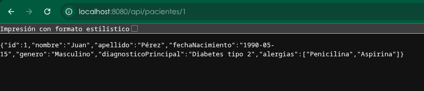

# fcv-technical

Como primera instancia se creo un repoitorio en git con el comando `git init`

## Backend

Luego con la ayuda de la pagina https://start.spring.io/ se creo la estructura base del proyecto. Se creo la carpeta backend, se movio el proyecto descargado y se organizaron los archivos correspondientes en carpetas, luego de esto 

En la siguiente imagen se muestra el funcionamiento del puerto 8080:

## Frontend

Inicializamos el proyecto de react con el comando npx create-vite@latest frontend -- --template react y seguidamente entramos a la carpeta con el comando `cd frontend` y luego con el comando `npm install` instalamos las dependencias.

