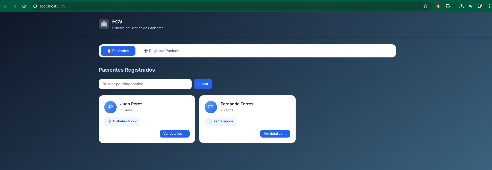
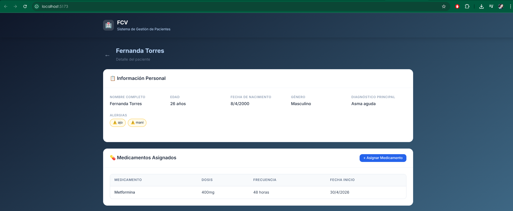
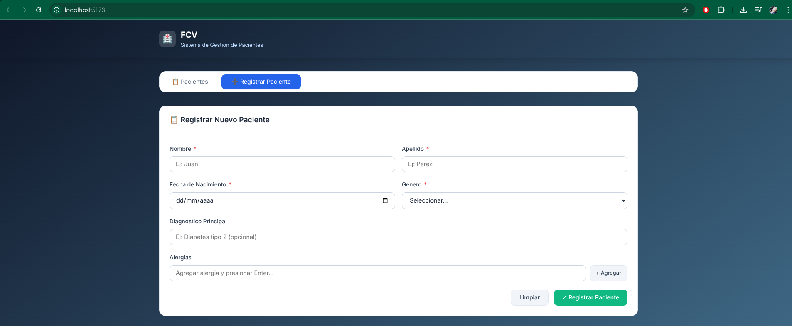
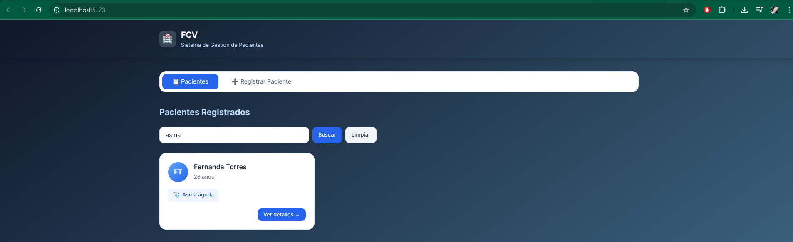

# FCV Technical — Sistema de Gestión de Pacientes y Medicamentos

Aplicación full-stack que permite registrar pacientes, medicamentos, buscar pacientes por diagnóstico y asignar medicamentos a pacientes.

---

## Tech Stack

| Capa | Tecnología | Versión |
|------|------------|---------|
| Backend | Spring Boot | 4.0.6 |
| Lenguaje | Java | 17 |
| Base de Datos | MySQL | 8.0 |
| ORM | Hibernate / JPA | 7.x |
| Frontend | React | 19.x |
| Bundler | Vite | 8.x |
| HTTP Client | Axios | 1.x |
| Estilos | CSS vanilla (diseño responsive) | — |

---

## Arquitectura

```
fcv-technical/
├── backend/                          # Spring Boot API REST
│   └── src/main/java/com/prueba/mi_api/
│       ├── config/                   # CORS configuration
│       ├── controller/               # REST Controllers
│       ├── dto/                      # Data Transfer Objects (Java Records)
│       ├── exception/                # Global exception handler
│       ├── model/                    # JPA Entities
│       ├── repository/               # Spring Data repositories
│       └── service/                  # Business logic
├── frontend/                         # React + Vite SPA
│   └── src/
│       ├── api/                      # Axios services
│       ├── components/               # React components
│       ├── App.jsx                   # Main app with tab navigation
│       └── index.css                 # Design system
└── README.md
```

### Modelo de datos

La relación **Paciente ↔ Medicamento** es muchos a muchos, implementada con una entidad intermedia `PacienteMedicamento` que contiene atributos propios (dosis, frecuencia, fecha de inicio).

---

## Instalación y Ejecución

### Prerrequisitos

- Java 17+
- Maven (o usar el wrapper `./mvnw`)
- Node.js 20+
- MySQL 8.0+ con una base de datos `fcv_db` creada

### 1. Clonar el repositorio

```bash
git clone https://github.com/Ferain93/fcv-technical.git
cd fcv-technical
```

### 2. Configurar la base de datos

Crear la base de datos en MySQL:

```sql
CREATE DATABASE fcv_db;
```

Configurar credenciales en `backend/src/main/resources/application.properties`:

```properties
spring.datasource.url=jdbc:mysql://localhost:3306/fcv_db
spring.datasource.username=root
spring.datasource.password=tu_password
```

### 3. Levantar el Backend (puerto 8080)

```bash
cd backend
./mvnw spring-boot:run
```

### 4. Levantar el Frontend (puerto 5173)

```bash
cd frontend
npm install
npm run dev
```

Acceder a la aplicación en: **http://localhost:5173**

---

## Endpoints de la API

### Pacientes

| Método | Endpoint | Descripción |
|--------|----------|-------------|
| `POST` | `/api/pacientes` | Registrar nuevo paciente |
| `GET` | `/api/pacientes` | Listar todos los pacientes |
| `GET` | `/api/pacientes/{id}` | Obtener paciente por ID |
| `GET` | `/api/pacientes/buscar?diagnostico=X` | Buscar por diagnóstico |

### Medicamentos

| Método | Endpoint | Descripción |
|--------|----------|-------------|
| `POST` | `/api/medicamentos` | Registrar nuevo medicamento |
| `GET` | `/api/medicamentos` | Listar todos |
| `GET` | `/api/medicamentos/{id}` | Obtener por ID |

### Asignaciones

| Método | Endpoint | Descripción |
|--------|----------|-------------|
| `POST` | `/api/asignaciones` | Asignar medicamento a paciente |
| `GET` | `/api/asignaciones/paciente/{id}` | Obtener asignaciones de un paciente |

### Validaciones implementadas

- Campos obligatorios: nombre, apellido, fecha de nacimiento, género
- Fecha de nacimiento debe ser **anterior a la fecha actual** (`@Past`)
- Stock de medicamentos no puede ser negativo (`@Min(0)`)
- Respuestas de error en formato JSON con códigos HTTP 400/404/500

---

## Capturas de Pantalla

### Backend — API funcionando en puerto 8080


### Frontend — Vista de lista de pacientes



### Frontend — Detalle de paciente con medicamentos asignados



### Frontend — Formulario de registro de paciente



### Frontend — Búsqueda por diagnóstico



---

## Prompts Utilizados

A continuación se documentan los prompts enviados al asistente de IA (Antigravity — Claude Opus 4.6) en cada fase del desarrollo:

### Fase 1 — Planificación del Backend

```
Crear una API REST que permita:
1) Registrar pacientes con los siguientes datos:
   ID (autogenerado), nombre, apellido, fecha de nacimiento, género,
   diagnóstico principal (opcional), alergias (lista opcional).
2) Registrar medicamentos con:
   ID (autogenerado), nombre, fabricante, fecha de caducidad, stock, indicaciones (texto).
3) Buscar pacientes por diagnóstico principal — endpoint GET que filtre pacientes por diagnóstico.
4) Asignar medicamentos a un paciente (relación muchos a muchos) con dosis, frecuencia y fecha de inicio.
```

> **Resultado:** Se generó un plan de implementación detallado con diagrama ER, estructura de paquetes, orden de implementación por capas (Model → DTO → Repository → Exception → Service → Controller → Config), y se obtuvo aprobación antes de escribir código.

### Fase 2 — Implementación del Backend

El plan aprobado se ejecutó de forma autónoma, creando 18 archivos nuevos organizados en capas. Se eliminó el código de ejemplo (`Producto`) y se verificó con `./mvnw compile` y pruebas curl en cada endpoint.

### Fase 3 — Frontend React

```
Consumir la API con el front en React que acabo de inicializar. Los requerimientos son:
1) Muestre una lista de pacientes con nombre completo, edad (calculada desde la fecha
   de nacimiento), diagnóstico principal y botón para ver detalles completos del paciente.
2) Formulario de registro de pacientes con campos obligatorios marcados con *.
   Estilizado con CSS.
3) Sección de "Medicamentos asignados" en el detalle del paciente.
   Tabla que muestre nombre del medicamento, dosis y frecuencia.
```

> **Resultado:** Se crearon 3 componentes React (`PacienteList`, `PacienteForm`, `PacienteDetalle`), capa de servicios API con Axios, y un design system completo con CSS vanilla. También se agregó un nuevo endpoint al backend (`GET /api/asignaciones/paciente/{id}`) para soportar la vista de detalle.

### Fase 4 — Bug fix y validaciones finales

```
Cuando damos en el botón limpiar hay algo que no está bien, no regresan todos los pacientes.
```

> **Resultado:** Se identificó una race condition donde `setBusqueda('')` es asíncrono y `cargarPacientes()` leía el valor viejo. Se resolvió pasando el término de búsqueda como parámetro directo a la función.

```
Los últimos cambios que faltan son:
- Para el backend, validar que los campos obligatorios no estén vacíos y que la fecha de
  nacimiento sea anterior a la fecha actual.
- En el frontend, diseño responsive (tarjetas en desktop, lista en móvil).
```

> **Resultado:** Se agregó `@Past` en el DTO y la entidad JPA. En CSS se implementó un layout que transforma las tarjetas en filas compactas tipo lista para pantallas ≤768px.

---

## Autor

**Luisa Fernanda Trujillo Navarro** — [GitHub](https://github.com/Ferain93)